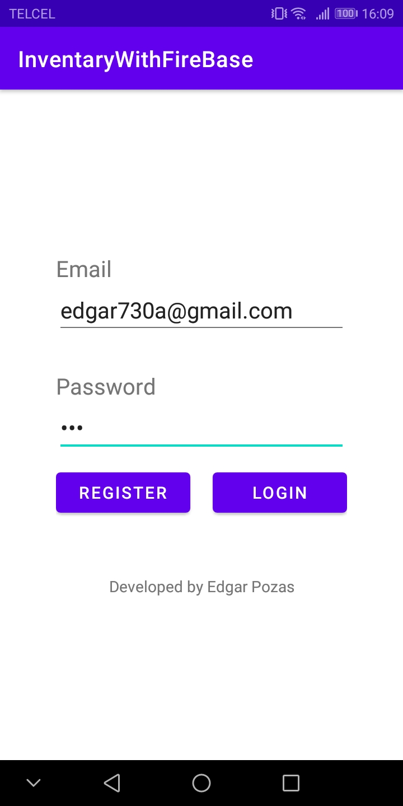
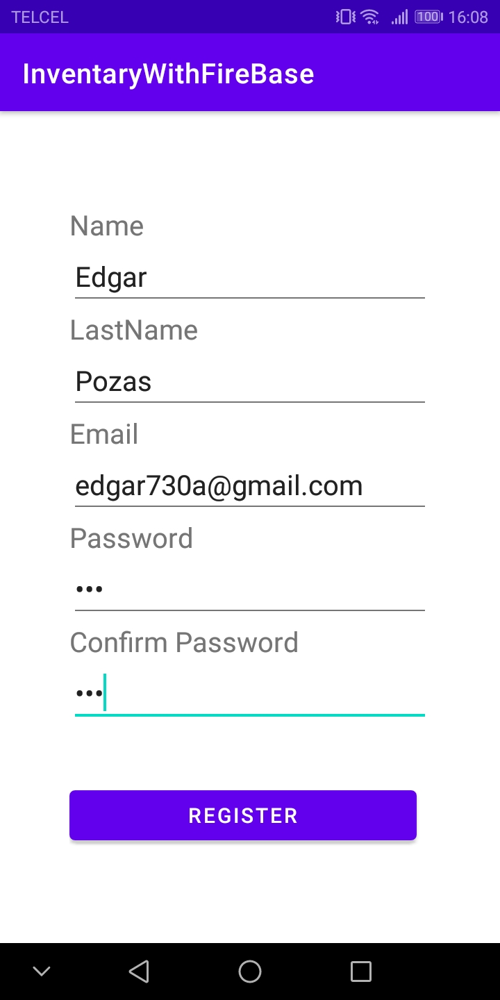
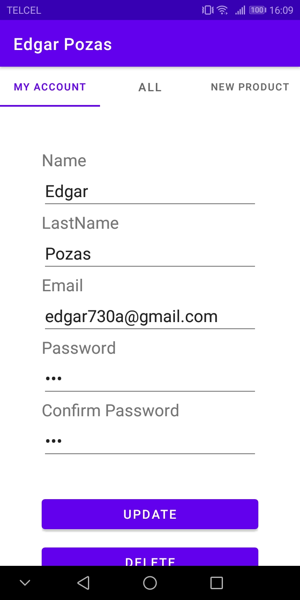
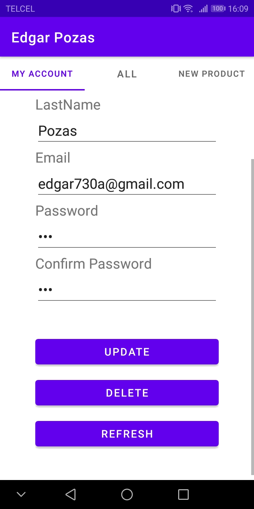
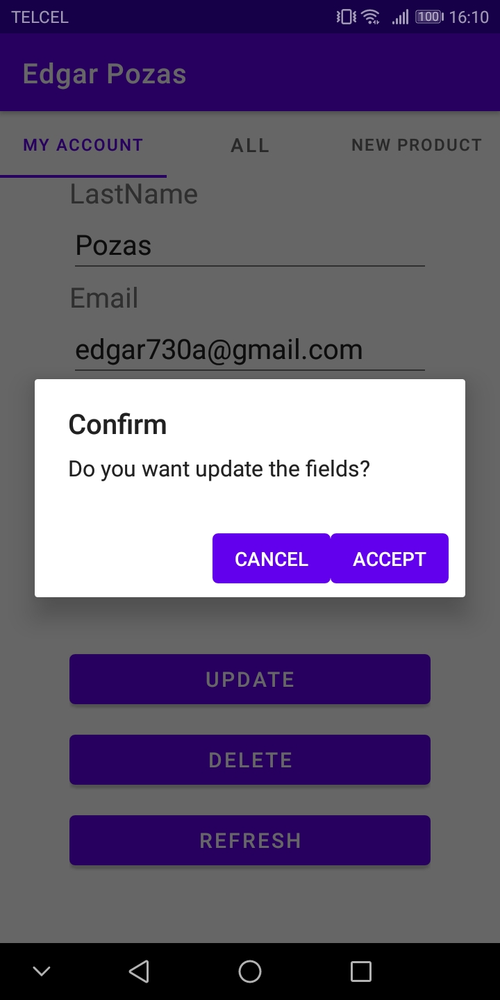
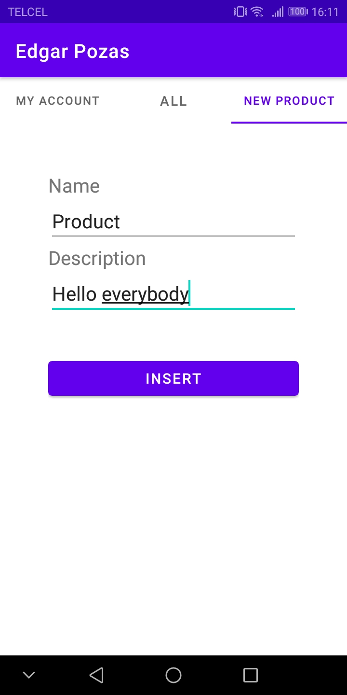

# InventaryWithFireBase

This project is about an Android app like inventary, which the users registered can see the their own products or manage the profile.

## Requirements
You need the following:
* Celphone Android
* Internet connection

## Tech used
* Android studio
* Programming language (Kotlin)
* Database (Firebase cloud)

## Installation

First download the project or clone the repository.

## Run
In order to start the project you have to add the project to Android studio. Next create a Firebase project and create the database.

## Views
### Login

### Register

### Manage account

### Manage account - Edit

### Manage account - Delete

### Create product

### Main board

